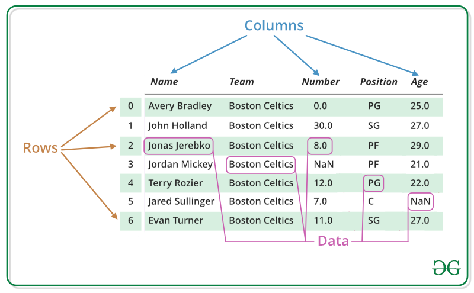

# Pandas Python: ¿Qué es, para qué sirve y cómo descargarlo?

## Introducción
La Ciencia de Datos es un campo que está ganando cada vez más notoriedad; pequeñas y grandes empresas, como Netflix, Airbnb y Google, ya están basando sus decisiones en datos. En este escenario, el lenguaje Python es bastante utilizado debido a su versatilidad y simplicidad, contando con una amplia cantidad de bibliotecas, entre ellas, Pandas, una de las herramientas esenciales cuando se habla de Ciencia de Datos.

En este artículo, vamos a conocer la biblioteca Pandas, comprender sus estructuras básicas y también cómo instalar la herramienta.

¿Pero qué exactamente es Pandas?

## ¿Qué es Pandas?
Pandas es una biblioteca para Ciencia de Datos de código abierto (open source), construida sobre el lenguaje Python, y que proporciona un enfoque rápido y flexible, con estructuras robustas para trabajar con datos relacionales (o etiquetados), y todo eso de manera sencilla y intuitiva.

A pesar de que el nombre de la biblioteca está asociado al mamífero de la familia Ursidae, al igual que Python está asociado erróneamente con la especie de cobra, el nombre de la biblioteca Pandas deriva del término ___Panel Data___, un concepto en inglés relacionado con el campo de estudio de la econometría.

De manera general, Pandas puede ser utilizado para diversas actividades y procesos, entre ellos: limpieza y tratamiento de datos, análisis exploratorio de datos (EDA), soporte en actividades de Machine Learning, consultas y queries en bases de datos relacionales, visualizaciones de datos, web scraping y mucho más. Además de eso, también posee una excelente integración con varias otras bibliotecas muy utilizadas en Ciencia de Datos, como: Numpy, Scikit-Learn, Seaborn, Altair, Matplotlib, Plotly, Scipy y otras.

## ¿Cómo funciona Pandas?
Dentro del paquete Pandas, tenemos dos objetos primarios importantes: las ``Series`` y los ``DataFrames``. Y para comprender un poco mejor sobre estas estructuras, vamos a utilizar como ejemplo un conjunto de datos llamado iris, que contiene información sobre características de especies de las flores de Íris.

## Series
Las Series son objetos de tipo array unidimensional, con un eje de etiquetas, también llamado index, que es responsable de identificar cada registro. Un ejemplo de Series en Pandas se encuentra en el conjunto de datos Iris cuando aislamos una de las variables para su visualización, por ejemplo, la longitud del pétalo (PetalLengthCm), donde podemos observar el siguiente formato:

0      1.4
1      1.4
2      1.3
3      1.5
4      1.4
      ... 
145    5.2
146    5.0
147    5.2
148    5.4
149    5.1
Name: PetalLengthCm, Length: 150, dtype: float64

La columna de números a la izquierda es el índice, y los datos se presentan a la derecha. Al final de la presentación, hay una pequeña descripción del nombre, formato y tipo de datos presentes en la Serie.

## DataFrame
Los DataFrames son objetos bidimensionales, de tamaño variable. Su formato es similar a una tabla, donde los datos se organizan en filas y columnas. Además, mientras que podemos pensar en las Series como una única columna, el DataFrame sería una colección de varias Series bajo un mismo índice. La estructura del DataFrame se presenta en la siguiente imagen:

Podemos trabajar con la creación de cada una de estas estructuras utilizando los métodos de Pandas (pandas.DataFrame y pandas.Series) sobre estructuras nativas de Python (como listas, arrays y diccionarios). También podemos trabajar con la lectura y escritura de varios tipos de archivos de datos, como:

- CSV;
- Hojas de calculo en el Excel;
- Parquet;
- SQL;
- HTML;
- JSON;
- XML
- y mucho más

## Pandas y el Excel
Debido a la adopción del paquete Office de Microsoft, que incluye el editor de hojas de cálculo Excel, surgen discusiones sobre por qué utilizar Pandas. Existen diferencias en las propuestas de cada software. Además de que Pandas es una solución de código abierto y no propietaria, a diferencia de Excel, también es posible observar diferencias en la cantidad de información que cada uno puede manejar.

En Excel, el límite de construcción de las tablas es de 1.048.576 filas por 16.384 columnas. En cambio, en Pandas, la limitación está basada en la cantidad de memoria disponible, lo que nos permite tener una gran variedad de filas y columnas siempre que la memoria asignada no exceda la cantidad disponible en su computadora.

Conocer los límites de cada herramienta se vuelve interesante cuando surge la necesidad de trabajar con conjuntos de datos más grandes, y incluso en casos extremos que fácilmente superan millones de registros, como en el escenario de Big Data.

Sin embargo, aunque estos software tienen propuestas diferentes, también pueden ser utilizados de manera conjunta, ya que Pandas ofrece compatibilidad con los archivos de Excel, tanto en la creación, la lectura como la escritura.

## ¿Cómo se utiliza Pandas?
En el día a día de un científico de datos, Pandas se utiliza bastante junto con los notebooks interactivos de Python (archivos con extensión .ipynb), como Jupyter Notebook, en los cuales también se basa Google Colab. La idea principal es aprovechar la buena presentación del código y de sus salidas, explorando la practicidad del modo interactivo, mientras se escribe el código y se observa rápidamente la salida.

Además de los Jupyter Notebooks, también es posible trabajar con scripts Python comunes (archivos .py). La diferencia es que la salida de todos los fragmentos de código se coloca en el terminal sin distinción, uno tras otro, y en formato raw (crudo).

## Instalación de Pandas

La forma más sencilla de instalar Pandas es usando pip, el instalador de paquetes de Python. Abre una terminal o símbolo del sistema y ejecuta pip install pandas. Si ya tienes Pandas y quieres actualizarlo, usa pip install --upgrade pandas. 

Pasos detallados:
1. Verificar Python y pip:
Asegúrate de tener Python y pip instalados en tu sistema. Puedes verificar las versiones con los comandos python --version y pip --version. 

2. Abrir la terminal:
Busca la terminal o símbolo del sistema en tu sistema operativo (CMD en Windows, Terminal en macOS/Linux). 

3. Instalar Pandas:
Ejecuta el siguiente comando: pip install pandas.

4. Verificar la instalación:
Después de la instalación, puedes verificar que Pandas está instalado correctamente importándolo en un script de Python o en la consola interactiva: 

   import pandas as pd
   print(pd.__version__)

 Si no se produce ningún error y se muestra la versión de Pandas, la instalación fue exitosa.   

